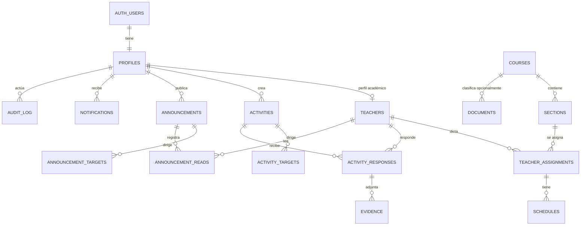

# Esquema de datos — Seguimiento EEGG 2026-2

Este documento describe la primera migración local propuesta para Supabase. La migración **no ha sido aplicada a ningún proyecto remoto** y no crea usuarios de Auth.

## Archivos

- `supabase/migrations/202608190001_initial_schema.sql`: esquema, constraints, índices, triggers y RLS.
- `supabase/seed.sql`: seed local opcional con un curso y una sección totalmente ficticios.
- `types/database.ts`: tipos de dominio para la integración futura, sin conectar las pantallas actuales.

## Modelo general



## Tablas y relaciones

| Tabla | Propósito | Conservación |
|---|---|---|
| `profiles` | Extensión 1:1 de `auth.users`; rol funcional y datos institucionales. | `active` permite desactivar. |
| `teachers` | Perfil académico asociado de forma única a un profile. | `active`; sin DNI. |
| `courses` | Catálogo de cursos. | `active`; código único cuando existe. |
| `sections` | Oferta de un curso por sección y ciclo. | `active`; curso/sección/ciclo único. |
| `teacher_assignments` | Relación docente–sección por ciclo. | `active`; no se borra historial en cascada. |
| `schedules` | Bloques horarios de una asignación. | Valida que fin sea posterior a inicio. |
| `activities` | Actividades creadas por Coordinación. | Estados `draft`, `published`, `closed`, `cancelled`. |
| `activity_targets` | Destino: todos, docente, curso o sección. | Constraint exige exactamente la FK correspondiente. |
| `activity_responses` | Cumplimiento individual, único por actividad/docente. | Historial protegido con FKs `RESTRICT`. |
| `evidence` | Metadatos de archivo o enlace de una respuesta. | Preparada para Storage; no crea bucket. |
| `announcements` | Comunicados con prioridad y vigencia. | `active` y expiración opcional. |
| `announcement_targets` | Destinos equivalentes a actividades. | Constraint de destino coherente. |
| `announcement_reads` | Lectura única por comunicado/docente. | Conserva historial. |
| `documents` | Recursos por categoría y curso opcional. | `active`; URL externa o ruta Storage requerida. |
| `tutorials` | Videos por categoría. | `active`. |
| `notifications` | Bandeja interna futura, sin Realtime. | El usuario solo podrá cambiar `read_at`. |
| `audit_log` | Registro administrativo básico. | Solo metadata no sensible. |

## Roles y Auth

Los roles funcionales son un enum: `docente` y `coordinacion`. No son credenciales. El flujo futuro será:

```text
auth.users.id → profiles.id → teachers.profile_id
```

El correo institucional se utilizará como método preferido de acceso en Supabase Auth. La migración no crea cuentas ni contraseñas. Para el primer usuario de Coordinación se necesitará un procedimiento administrativo controlado después de crear el usuario en Auth; las políticas no permiten que un usuario anónimo se otorgue ese rol.

## Seguridad y RLS

Todas las tablas de aplicación tienen RLS habilitado. Las funciones de `private` son `SECURITY DEFINER`, tienen `search_path` vacío y usan nombres completamente calificados. Esto permite consultar el rol y los destinos sin provocar recursión entre políticas.

### Docente

- Lee su propio `profile` y `teacher`.
- Lee únicamente asignaciones, secciones, cursos y horarios que le pertenecen.
- Ve actividades publicadas/cerradas dirigidas a todos, a él, a uno de sus cursos o a una de sus secciones.
- Lee y actualiza su propia respuesta. Un trigger impide cambiar `teacher_id`, `activity_id`, `coordinator_comment` o usar estados reservados a Coordinación.
- Crea y lee evidencias vinculadas a sus respuestas.
- Solo modifica respuestas mientras la actividad está publicada. Una respuesta revisada por Coordinación queda bloqueada para el docente.
- `completed_at` lo establece automáticamente la base de datos al completar la respuesta.
- Ve comunicados activos y vigentes dirigidos a él y registra su propia lectura.
- Lee documentos generales activos y documentos activos de sus cursos asignados; lee tutoriales activos.
- Lee sus notificaciones y solamente puede modificar `read_at`.

### Coordinación

Puede administrar docentes, cursos, secciones, asignaciones, horarios, actividades, destinos, respuestas, evidencias, comunicados, documentos, tutoriales y notificaciones. Puede leer e insertar auditoría identificándose como el usuario autenticado.

`service_role` no debe incluirse nunca en el frontend. Las operaciones administrativas privilegiadas futuras deberán ejecutarse desde Supabase Dashboard, CLI controlada o una función de servidor segura.

## Flujo de actividad

1. Coordinación crea una actividad en `draft`.
2. Registra uno o más destinos coherentes en `activity_targets`.
3. Al publicar, establece `published_at`, `due_at` y estado `published`.
4. Un proceso de aplicación o función futura materializa una `activity_response` por docente destinatario.
5. El docente completa su respuesta y, si corresponde, agrega `evidence`.
6. Coordinación revisa y puede marcar `exempt` o `rejected` y añadir `coordinator_comment`.

### Decisión sobre `overdue`

`overdue` se conserva en el enum porque puede ser útil para reportes consolidados, notificaciones y cierres. Sin embargo, la interfaz no debe depender exclusivamente del valor almacenado. El estado efectivo recomendado es:

```sql
case
  when ar.status = 'pending' and a.due_at < now() then 'overdue'
  else ar.status::text
end
```

Más adelante se puede añadir una función programada que persista `overdue`; hasta entonces, consultas y reportes deben calcularlo desde `due_at` para evitar estados desactualizados.

## Flujo de comunicado

1. Coordinación crea el comunicado y su prioridad.
2. Define destinos en `announcement_targets`.
3. Un docente solo lo ve si está activo, publicado, no expiró y coincide con algún destino.
4. Al abrirlo, se inserta una fila única en `announcement_reads`.

## Borrado y conservación

- Catálogos y entidades académicas usan `active` para desactivación lógica.
- Las relaciones históricas principales usan `ON DELETE RESTRICT`.
- Los destinos usan `CASCADE` respecto de su actividad/comunicado porque no tienen valor independiente; una actividad con respuestas históricas no podrá borrarse debido a las FKs restrictivas de respuestas.
- `created_by` y el actor de auditoría usan `SET NULL` para conservar registros si el perfil deja de existir.
- No hay `DROP`, `TRUNCATE` ni operaciones remotas en la migración.

## Evidencias y Storage

La tabla guarda únicamente metadata. `file_path` será la ruta de un bucket privado de Supabase Storage y `external_url` representa un enlace externo. El bucket y sus políticas se definirán en una migración posterior, cuando se acuerden tamaño máximo, MIME permitidos y estrategia de descarga firmada.

## Auditoría

La tabla queda preparada, pero esta primera migración no instala triggers genéricos que copien filas completas. Esa decisión evita duplicar teléfonos, correos o contenido en `metadata`. La aplicación o funciones de servidor futuras deberán registrar acciones explícitas y metadata mínima.

## Revisión y aplicación segura

1. Revisar el SQL y esta documentación en una rama local.
2. Instalar/inicializar Supabase CLI si todavía no está configurada.
3. Crear un proyecto Supabase local y ejecutar `supabase start`.
4. Aplicar desde cero solo en local con `supabase db reset` y revisar su salida. Esto también ejecutaría el seed opcional, por lo que puede retirarse temporalmente si no se desea.
5. Ejecutar pruebas RLS con usuarios ficticios de ambos roles en local.
6. Generar tipos oficiales con `supabase gen types typescript --local` y compararlos con `types/database.ts`.
7. Revisar el diff SQL con `supabase db diff`.
8. Solo después de aprobación expresa, vincular el proyecto remoto y aplicar con el flujo controlado de la CLI. No ejecutar `db push` antes de esa aprobación.
